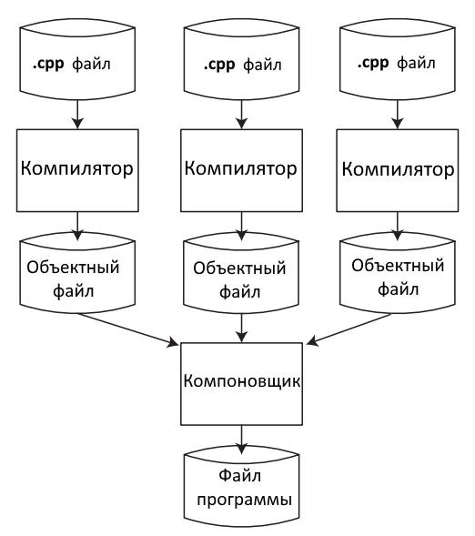

# Введение в с++ #

## Язык программирования с++ ##

Язык программирования с++ представляет собой высокоуровневый компилируемый язык программирования общего назначения, со статической типизации.
Своими корнями с++ уходит в язык с, который был разработан в 1969-1973г компанией Bell Labs Денисом Ритчи.
В НАЧАЛЕ 80-ЫХ датский программист Бьерн Страуструп разработал С++, как расширение к языку С.
Фактически в начале С++ был дополнением для С и дополнял возможностями ООП, и назывался С классом.
С++ является компилируемым языком, а это означает что компилятор транслирует исходный код на С++ в исполняемый файл, который содержит набор машинных инструкций.
**ОСновные компиляторы:**
1) G++
2) Clang
3) компилятор Microsoft VS

**Состав компилятора G++:**
1) CPP(препроцессор)
2) as-асемблер
3) G++ компилятор
4) ID-линкер

Исходный С++ файл - это всего лишь код, но его невозможно запустить как программу, поэтому каждый исходный файл требуется скомпилировать в исполняемый

**Этапы компиляции:**
1) Препроцессинг (Макропроцессор который преобразует программу для последующего компилирования. На данной стадии происходит работа с препроцессорными директивами.
Например: добавления HEader-код)
2) Компиляция -  это промежуточный шаг между высокоуровневым языком и машинным кодом. 
3) Ассемблер - перевод ассемблерного кода в машинный.

Объектный файл созданный ассемблером временный файл хранящий кусок машинного кода, этот кусок машинного кода, который не был связан с другими кусками кода, называется объектным кодом.

Компоновка - компоновщик (линкер) связывает все объектные файлы и все статичные библиотеки в единый исполняемый файл.

**Описнаие работы С++ в Visual Studio с объяснением каждого файла.**

**1. Файл решения (.sln)**
Назначение: Файл решения является контейнером верхнего уровня, объединяющим один или несколько проектов. Он хранит информацию о том, какие проекты входят в решение, их взаимосвязи, конфигурации сборки (Debug/Release, x86/x64) и настройки среды Visual Studio для этого решения.

Содержимое: Текстовый файл с собственной структурой, похожей на INI-формат. Он содержит список проектов, их GUID, пути к файлам проектов, а также конфигурации платформ.

Когда используется: Visual Studio открывает .sln для загрузки всех связанных проектов. При сборке решения MSBuild использует его для определения порядка сборки проектов с учётом зависимостей.

Пример фрагмента:

text
Microsoft Visual Studio Solution File, Format Version 12.00
# Visual Studio Version 17
Project("{8BC9CEB8-8B4A-11D0-8D11-00A0C91BC942}") = "MyApp", "MyApp\MyApp.vcxproj", "{GUID}"
EndProject

**2. Файл проекта (.vcxproj)**
Назначение: Основной файл проекта C++. Содержит все настройки компиляции, компоновки, списки исходных файлов, заголовков, ресурсов, параметры препроцессора, оптимизации и т.д. Используется системой MSBuild для сборки проекта.

Содержимое: XML-документ, описывающий конфигурации проекта (Debug, Release и т.д.), платформы (Win32, x64, ARM), свойства компилятора и компоновщика, а также группы элементов (ClCompile, ClInclude, ResourceCompile и т.д.) со списками файлов.

Когда используется: Visual Studio читает .vcxproj для отображения дерева проекта, для IntelliSense, для сборки. При изменении настроек проекта через диалоговые окна Visual Studio изменения сохраняются в этом файле.

Пример фрагмента:

xml
<Project DefaultTargets="Build" ToolsVersion="17.0" xmlns="http://schemas.microsoft.com/developer/msbuild/2003">
  <ItemGroup Label="ProjectConfigurations">
    <ProjectConfiguration Include="Debug|Win32">
      <Configuration>Debug</Configuration>
      <Platform>Win32</Platform>
    </ProjectConfiguration>
  </ItemGroup>
  <PropertyGroup Label="Globals">
    <ProjectGuid>{...}</ProjectGuid>
    <Keyword>Win32Proj</Keyword>
    <RootNamespace>MyApp</RootNamespace>
  </PropertyGroup>
  ...
  <ItemGroup>
    <ClCompile Include="main.cpp" />
    <ClInclude Include="myclass.h" />
  </ItemGroup>
</Project>

**3. Файл фильтров (.vcxproj.filters)**
Назначение: Используется только средой Visual Studio для организации файлов проекта в виртуальные папки (фильтры) в обозревателе решений. Не влияет на сборку.

Содержимое: XML-файл, который сопоставляет каждый файл проекта с определённым фильтром (например, "Исходные файлы", "Заголовочные файлы", "Файлы ресурсов"). Можно создавать собственные папки-фильтры.

Когда используется: Visual Studio читает этот файл при отображении структуры проекта. Если файл отсутствует, все файлы будут отображаться в корне проекта, но сборка продолжится.

Пример:

xml
<Project ToolsVersion="4.0" xmlns="http://schemas.microsoft.com/developer/msbuild/2003">
  <ItemGroup>
    <Filter Include="Исходные файлы">
      <UniqueIdentifier>{...}</UniqueIdentifier>
      <Extensions>cpp;c;cc;cxx;def;odl;idl;hpj;bat;asm;asmx</Extensions>
    </Filter>
    <Filter Include="Заголовочные файлы">
      <UniqueIdentifier>{...}</UniqueIdentifier>
      <Extensions>h;hh;hpp;hxx;hm;inl;inc;ipp;xsd</Extensions>
    </Filter>
    <Filter Include="Файлы ресурсов">
      <UniqueIdentifier>{...}</UniqueIdentifier>
      <Extensions>rc;ico;cur;bmp;dlg;rc2;rct;bin;rgs;gif;jpg;jpeg;jpe;resx;tiff;tif;png;wav;mfcribbon-ms</Extensions>
    </Filter>
  </ItemGroup>
  <ItemGroup>
    <ClCompile Include="main.cpp">
      <Filter>Исходные файлы</Filter>
    </ClCompile>
    <ClInclude Include="myclass.h">
      <Filter>Заголовочные файлы</Filter>
    </ClInclude>
  </ItemGroup>
</Project>

**4. Файл пользовательских настроек (.vcxproj.user)**
Назначение: Хранит персональные настройки конкретного пользователя для данного проекта, например, параметры отладки (командные аргументы, рабочая папка), выбранную конфигурацию для запуска, настройки IntelliSense, расположение точек останова и т.п.

Содержимое: XML-файл с локальными настройками. Обычно не включается в систему контроля версий (добавляется в .gitignore).

Когда используется: Visual Studio автоматически создаёт и изменяет этот файл при работе пользователя. При передаче проекта другому разработчику этот файл не обязателен.

Пример:

xml
<Project ToolsVersion="Current" xmlns="...">
  <PropertyGroup Condition="'$(Configuration)|$(Platform)'=='Debug|Win32'">
    <LocalDebuggerWorkingDirectory>$(ProjectDir)</LocalDebuggerWorkingDirectory>
    <DebuggerFlavor>WindowsLocalDebugger</DebuggerFlavor>
    <LocalDebuggerCommandArguments>--verbose</LocalDebuggerCommandArguments>
  </PropertyGroup>
</Project>

**5. Исходные файлы C++ (.cpp)**
Назначение: Содержат реализацию функций, методов классов, глобальных переменных и т.д. Это основные файлы, которые компилируются в объектные файлы (.obj).

Содержимое: Код на языке C++.

Когда используется: Компилятор обрабатывает каждый .cpp файл отдельно, создавая объектный файл. Затем компоновщик объединяет объектные файлы в исполняемый файл.

Пример (main.cpp):

cpp
#include <iostream>
#include "myclass.h"

int main() {
    MyClass obj;
    obj.printMessage();
    return 0;
}

**6. Заголовочные файлы (.h, .hpp)**
Назначение: Содержат объявления классов, функций, констант, макросов, которые должны быть доступны в нескольких единицах трансляции. Подключаются в .cpp файлах через директиву #include.

Содержимое: Объявления (прототипы функций, определения классов, inline-функции, шаблоны). Обычно защищены от повторного включения с помощью #pragma once или include guards.

Когда используется: Препроцессор вставляет содержимое заголовочного файла в .cpp перед компиляцией. Позволяет избежать дублирования кода и обеспечивает модульность.

Пример (myclass.h):

cpp
#pragma once
#include <string>

class MyClass {
public:
    void printMessage() const;
private:
    std::string message = "Hello from MyClass!";
};

**7. Предварительно откомпилированные заголовки (pch.h, pch.cpp)**
Назначение: Ускоряют компиляцию за счёт предварительной компиляции часто используемых заголовочных файлов (обычно стандартных библиотек, Windows.h и т.п.). В Visual Studio по умолчанию для новых проектов создаются файлы pch.h и pch.cpp.

Содержимое:

pch.h — включает все заголовки, которые должны быть предварительно скомпилированы (например, <iostream>, <vector>). Также может содержать общие для проекта объявления.

pch.cpp — обычно содержит только #include "pch.h". Компилятор создаёт из него файл с предварительно откомпилированным заголовком (.pch).

Когда используется: Каждый .cpp файл должен включать pch.h первым (если включена опция использования PCH). При компиляции вместо повторного разбора этих заголовков компилятор загружает готовый .pch, что экономит время.

Примечание: В более старых версиях Visual Studio использовались stdafx.h и stdafx.cpp — то же самое, просто переименовано.

**8. Файлы ресурсов (.rc, resource.h)**
Назначение: Используются в проектах Windows (GUI, DLL и т.д.). Содержат описание ресурсов приложения: иконки, диалоговые окна, меню, строки, версии и др.

Содержимое:

.rc — текстовый файл с описанием ресурсов в специальном синтаксисе (или скомпилированный скрипт ресурсов).

resource.h — заголовочный файл с идентификаторами ресурсов (IDI_ICON1, IDD_ABOUTBOX и т.д.).

Дополнительные файлы: иконки (.ico), курсоры (.cur), растровые изображения (.bmp), манифест (.manifest) и т.п.

Когда используется: Ресурсный компилятор (rc.exe) преобразует .rc в двоичный файл .res, который затем компонуется в исполняемый файл. Позволяет хранить в приложении иконки, версии, локализованные строки.

Пример фрагмента .rc:

text
IDI_MYAPP ICON "myapp.ico"
IDD_ABOUTBOX DIALOGEX 0, 0, 200, 100
STYLE DS_SETFONT | DS_MODALFRAME | WS_POPUP | WS_CAPTION
CAPTION "About MyApp"
BEGIN
    DEFPUSHBUTTON "OK", IDOK, 75, 80, 50, 14
END

**9. Файл манифеста приложения (app.manifest)**
Назначение: XML-файл, определяющий параметры выполнения приложения: требуемые права администратора, совместимость с версиями Windows, зависимости от библиотек (например, Common Controls 6), DPI-осведомлённость и т.д.

Содержимое: XML-документ с описанием зависимостей и настроек.

Когда используется: Включается в ресурсы проекта (обычно указывается в .rc) и встраивается в исполняемый файл. Windows использует манифест при запуске программы для применения указанных настроек.

Пример:

xml
<?xml version="1.0" encoding="utf-8"?>
<assembly manifestVersion="1.0" xmlns="urn:schemas-microsoft-com:asm.v1">
  <trustInfo xmlns="urn:schemas-microsoft-com:asm.v3">
    <security>
      <requestedPrivileges>
        <requestedExecutionLevel level="asInvoker" uiAccess="false" />
      </requestedPrivileges>
    </security>
  </trustInfo>
  <dependency>
    <dependentAssembly>
      <assemblyIdentity type="win32" name="Microsoft.Windows.Common-Controls" version="6.0.0.0" processorArchitecture="*" publicKeyToken="6595b64144ccf1df" language="*" />
    </dependentAssembly>
  </dependency>
</assembly>

        
10. Файл AssemblyInfo.cpp (для проектов .NET/CLR или Windows)
Назначение: В проектах C++/CLI или некоторых типах проектов Windows содержит метаданные сборки (версия, имя, культура, атрибуты).

Содержимое: Код C++, использующий атрибуты .NET для задания информации о сборке.

Когда используется: Компилируется в метаданные сборки. Для обычных проектов Win32 этот файл может отсутствовать.

Пример:

cpp
#include "pch.h"
using namespace System;
using namespace System::Reflection;

[assembly:AssemblyTitleAttribute("MyApp")];
[assembly:AssemblyDescriptionAttribute("")];
[assembly:AssemblyVersionAttribute("1.0.*")];
**11. Файл .gitignore**
Назначение: Указывает системе контроля версий Git, какие файлы и папки не следует отслеживать. Visual Studio может генерировать стандартный .gitignore для проектов C++.

Содержимое: Список шаблонов имён файлов (например, *.user, Debug/, Release/, *.pdb, *.obj).

Когда используется: При работе с Git. Предотвращает попадание в репозиторий временных и локальных файлов.

Пример фрагмента:

text
# Visual Studio user-specific files
*.suo
*.user
# Build results
[Dd]ebug/
[Rr]elease/
x64/
[Bb]in/
[Oo]bj/
**12. Выходные файлы сборки**
Во время сборки создаются промежуточные и конечные файлы. Они обычно размещаются в подкаталогах Debug, Release, x64 и т.п. внутри папки проекта или решения.

Объектные файлы (.obj)
Создаются компилятором для каждого .cpp файла. Содержат машинный код и данные, но с неразрешёнными ссылками на внешние символы.

Исполняемый файл (.exe)
Конечный результат сборки для программы. Создаётся компоновщиком из объектных файлов и библиотек.

Библиотеки (.lib, .dll)
Статическая библиотека (.lib) — архив объектных файлов, подключается на этапе компоновки.

Динамическая библиотека (.dll) — исполняемый файл, загружаемый во время выполнения; для компоновки также используется импортная библиотека (.lib).

База данных программы (.pdb)
Содержит отладочную информацию (имена переменных, строки кода, типы) для отладчика. Используется при отладке.

Файл инкрементальной компоновки (.ilk)
Используется компоновщиком для ускорения повторной компоновки при внесении небольших изменений.

Файл предварительно откомпилированного заголовка (.pch)
Создаётся из pch.cpp. Содержит скомпилированное представление заголовков.

Файлы журнала сборки (.log, .tlog)
Могут создаваться системой сборки для отслеживания зависимостей и ускорения инкрементальной сборки.

Файлы ресурсов (.res)
Скомпилированный файл ресурсов, создаётся из .rc и затем включается в компоновку.

Временные файлы (.tlog, .lastbuildstate и др.)
Используются MSBuild для отслеживания изменений и определения необходимости пересборки.

**13. Файлы IntelliSense и навигации**
.vs/ папка
Содержит локальные настройки Visual Studio для решения: кэш IntelliSense, настройки окон, базу данных навигации (файл .sdf или .db). Не включается в систему контроля версий.

.suo (Solution User Options)
Раньше хранил пользовательские настройки решения (точки останова, раскладку окон). В новых версиях заменён папкой .vs.

**14. Дополнительные файлы, которые могут встречаться**
CMakeLists.txt — если проект использует CMake вместо .vcxproj.

.editorconfig — настройки стиля кода для редактора.

README.md — документация проекта.

LICENSE — лицензия.

packages.config или vcpkg.json — для управления зависимостями (NuGet, vcpkg).
